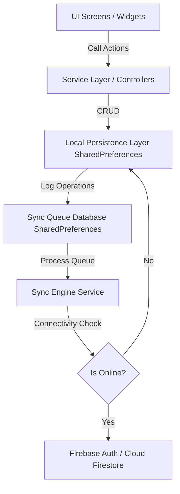

# Master Audit Report: Mental Mantra Release Readiness

**Project Name:** Mental Mantra  
**Audit Date:** June 16, 2026  
**Auditor:** Lead Architect / QA Lead / Release Manager  
**Codebase Version:** v1.0.0+1  

---

## 1. Executive Summary

Mental Mantra is a mental wellness companion app featuring journaling, mood tracking, recovery logs, and AI coaching. The codebase is currently fully offline-capable, using mock Firebase packages (`cloud_firestore`, `firebase_analytics`, `firebase_crashlytics`, `firebase_storage`, and `cloud_functions`) that write serialized JSON payloads to `SharedPreferences`. `firebase_core` has been reintegrated with the live Firebase project ID `mental-mantra-2024` and compiled cleanly.

This audit evaluates the codebase to move from the offline-only mock baseline to a **hybrid cloud-synchronization model** that keeps local data as the source of truth, adds real Firebase Authentication (Anonymous, Google, and Apple sign-in), and backs up data to Cloud Firestore in the background using a Sync Queue.

---

## 2. Build Status & Risk Matrix

### 2.1 Build Status
- **Static Analysis**: `flutter analyze` returns **0 issues** (no warnings, errors, or lints).
- **Release Compilation**: Android release build builds successfully (`app-release.apk`, 71.3MB) with ProGuard obfuscation (`isMinifyEnabled = true`, `isShrinkResources = true`).
- **Dependencies**: The app uses contemporary dependencies. To move to production integration, we must restore the official versions of the mocked packages and add `firebase_auth`.

### 2.2 Risk Matrix

| Risk ID | Risk Description | Severity | Likelihood | Mitigation Strategy |
| :--- | :--- | :--- | :--- | :--- |
| **R-01** | **Local Data Overwrite during Sync**: Synchronizing local data with Firestore might overwrite newer offline modifications with older cloud data during network transitions. | CRITICAL | Medium | Implement timestamp-based conflict resolution ("last-write-wins" or merging field changes) and enforce local-first storage. |
| **R-02** | **UID Migration / Identity Loss**: Transitioning from simulated local user IDs (`user_dev_xxx`) to Firebase Auth anonymous/federated UIDs could detach existing offline records. | HIGH | High | When Auth initializes, run a one-time migration to link/rewrite all keys in SharedPreferences containing the old ID to the new Firebase UID. |
| **R-03** | **Network Bloat / Battery Drain**: Frequent write retries in a background sync loop while the device has poor connectivity can drain battery and consume data. | MEDIUM | Medium | Implement an exponential backoff retry mechanism (e.g., 5s, 15s, 60s, 5m, 1h) and check actual connectivity before attempting sync. |
| **R-04** | **API Quota Exceeded**: Frequent telemetry, logs, or chat queries could exceed Firebase Spark plan limits. | MEDIUM | Low | Batch telemetry events and throttle background sync frequencies. |

---

## 3. Bug & Vulnerability List

| Bug ID | Component | Problem Description | Severity | Impact |
| :--- | :--- | :--- | :--- | :--- |
| **B-01** | **Startup / Auth Gate** | `AuthWrapper` in [main.dart](file:///c:/Users/kuldeep/OneDrive/Desktop/mental%20mantra/lib/main.dart) uses a redundant `FutureBuilder` to fetch user profiles, causing a double-fetch at startup since `AuthService` already fetched the same data. | MEDIUM | Performance lag on app launch (~100-300ms). |
| **B-02** | **Authentication** | The application does not use `firebase_auth`; instead it relies on custom mock users and generated IDs, meaning there is no secure cloud session or account recovery. | HIGH | Lack of cross-device syncing and account protection. |
| **B-03** | **Chat Sync** | The `AIService` chat history is stored both in `SharedPreferences` and in Firestore in an un-synced way, leading to potential discrepancies when offline. | MEDIUM | Chat messages sent offline are not queued for cloud synchronization. |
| **B-04** | **ProGuard / R8** | ProGuard rules in `proguard-rules.pro` might strip reflection classes used by `youtube_explode_dart` or audio players, risking runtime crashes in release. | MEDIUM | Music playback or video playing could crash on device. |
| **B-05** | **Secure Storage** | The app uses `FlutterSecureStorage` without explicitly setting Android encrypted preferences backup options, which can leak keys on auto-backups. | LOW | Minor security concern for rooted devices. |

---

## 4. Architecture & Sync Engine Strategy

The goal is to maintain the local-first architecture using a clean **Sync Queue** structure:



### 4.1 Sync Queue Record Structure
The Sync Queue will be persisted in `SharedPreferences` as a list of operations under the key `sys_sync_queue`. Each item contains:
- `id`: Unique operation ID.
- `collection`: Target Firestore collection (e.g., `journals`, `mood_logs`).
- `docId`: Firestore document ID.
- `action`: `SET`, `UPDATE`, or `DELETE`.
- `data`: Map containing the serialized JSON data (null for delete).
- `timestamp`: ISO-8601 string of when the change occurred.

### 4.2 Conflict Resolution
- **Rule**: Last-Write-Wins (LWW) based on `updatedAt` or `timestamp`.
- **Logic**: During synchronization, we compare the local record's timestamp with the cloud record's timestamp. The newer timestamp wins.

---

## 5. Security & Firebase Rules Recommendations

### 5.1 Authentication Upgrade Path
1. **Anonymous Sign-In**: Automatically sign user in anonymously on first launch.
2. **Account Linking**: Provide a button in Settings to "Link Google Account" or "Link Apple Account".
3. **Upgrade Flow**: Use `linkWithCredential` to convert the anonymous user to a permanent user without changing their UID, preserving all cloud and local database paths.

### 5.2 Firestore Collection Rules (`firestore.rules`)
```javascript
rules_version = '2';
service cloud.firestore {
  match /databases/{database}/documents {
    // Default deny
    match /{document=**} {
      allow read, write: if false;
    }
    
    // User profile document
    match /users/{userId} {
      allow read, write: if request.auth != null && request.auth.uid == userId;
    }
    
    // Sub-collections or partitioned data by userId
    match /journals/{journalId} {
      allow read, write: if request.auth != null && resource.data.userId == request.auth.uid;
      allow create: if request.auth != null && request.resource.data.userId == request.auth.uid;
    }

    match /addiction_profiles/{profileId} {
      allow read, write: if request.auth != null && resource.data.userId == request.auth.uid;
      allow create: if request.auth != null && request.resource.data.userId == request.auth.uid;
    }

    match /urge_logs/{urgeId} {
      allow read, write: if request.auth != null && resource.data.userId == request.auth.uid;
      allow create: if request.auth != null && request.resource.data.userId == request.auth.uid;
    }

    match /recovery_milestones/{milestoneId} {
      allow read, write: if request.auth != null && resource.data.userId == request.auth.uid;
      allow create: if request.auth != null && request.resource.data.userId == request.auth.uid;
    }

    match /recovery_xp/{userId} {
      allow read, write: if request.auth != null && request.auth.uid == userId;
    }
    
    match /user_chat_messages/{messageId} {
      allow read, write: if request.auth != null && resource.data.userId == request.auth.uid;
      allow create: if request.auth != null && request.resource.data.userId == request.auth.uid;
    }
  }
}
```

---

## 6. Performance Optimization Recommendations

1. **Eliminate Redundant Reads (Double-Fetch)**: Optimize `AuthWrapper` in `main.dart` to directly consume `AuthService.dbUser` instead of performing another `get()` to Firestore.
2. **Batch Writes**: When logging multiple urges or milestones, run local writes immediately, and batch them for Cloud Firestore uploads.
3. **List View Optimization**: Ensure all long lists (e.g., in `JournalScreen`, `RecoveryScreen`) use `ListView.builder` with `itemExtent` or simple keys to prevent unnecessary re-rendering.
4. **SharedPreferences Caching**: Keep an in-memory representation of frequently accessed data (like settings or user profiles) in the Service layers to avoid continuous asynchronous reading of disk storage.

---

## 7. Action Plan & Next Steps

### Phase 1: Authentication & UID Migration (High Priority)
- Install `firebase_auth` in `pubspec.yaml`.
- Update `AuthService` to use Firebase Auth.
- Implement anonymous sign-in and local-to-anonymous UID migration.
- Add Google Sign-in & Apple Sign-in UI bindings and link account logic.

### Phase 2: Mock Package Upgrades & Sync Engine (High Priority)
- Declare `real_cloud_firestore` dependency under renamed namespace in `pubspec.yaml` to access the real Firestore SDK.
- Build the `SyncQueueService` inside mock `cloud_firestore` package (or in `lib/services/sync_service.dart`).
- Log every CRUD operation in `SharedPreferences` as a queue task.
- Build background synchronization worker (periodically triggered, or triggered on online connectivity status changes).

### Phase 3: Runtime Stability & Performance Fixes (Medium Priority)
- Remove `FutureBuilder` in `AuthWrapper` in `main.dart`.
- Confirm ProGuard rules in `android/app/proguard-rules.pro` for media playbacks and animations.
- Implement internet connectivity check wrapper (e.g., simple DNS lookup or package checking).

### Phase 4: Production Checklist & Release Validation (Low Priority)
- Deploy Firestore security rules and create required composite indexes (e.g., query index on `timestamp` / `userId` for chat history).
- Verify release signing configuration.
- Verify Crashlytics and Analytics.
