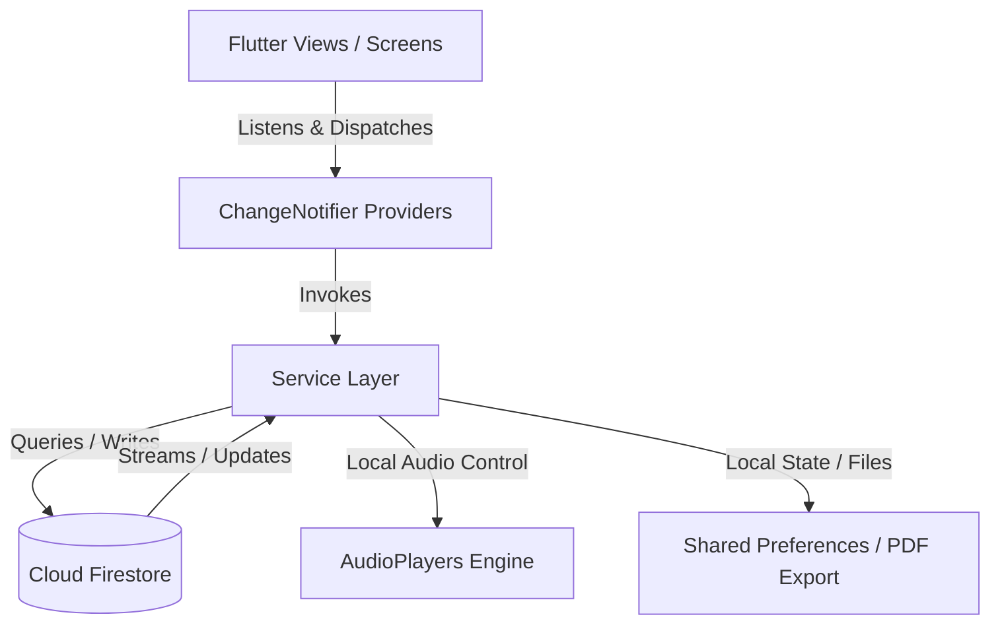
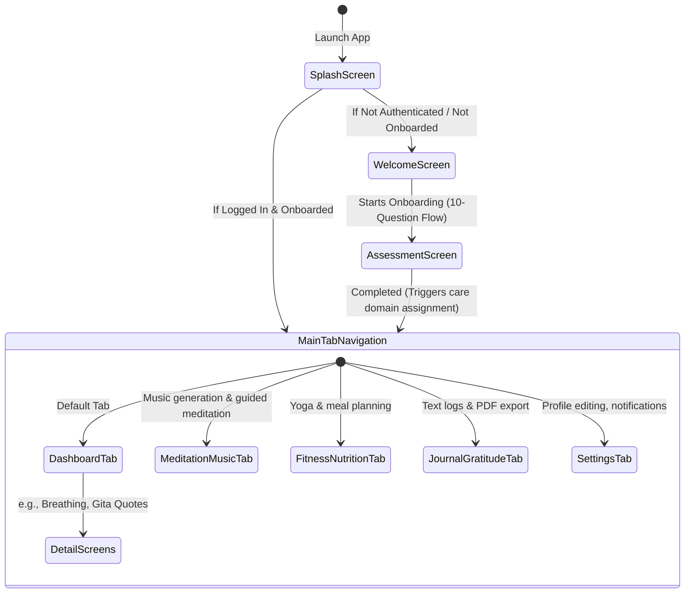

# Mental Mantra — Application Architecture Specification

This document details the high-level architecture, state management patterns, service layer, data flow, and navigation structure of the **Mental Mantra** application.

---

## 1. High-Level Architectural Patterns

Mental Mantra is built on a clean **Model-View-Service** (MVS) style architecture using the **Provider** pattern for state management and reactive data flow:

### Key Architectural Pillars:
* **Decoupled Business Logic**: Screens do not directly interact with Cloud Firestore or other SDKs. All operations go through dedicated Service classes.
* **Reactive UI State**: Providers encapsulate application state and expose it to the Widget tree via `ChangeNotifier`. Changes in state trigger selective UI rebuilds.
* **Unified Database Access**: Services leverage `FirestoreService` to execute standardized operations against Firestore, ensuring consistency and ease of auditing.

---

## 2. State Management & Providers

State management is structured using Flutter's `provider` package. The app registers global providers in `main.dart` to manage the lifecycle of user authentication, onboarding, content delivery, and media playback.

### Key Providers:
1. **`AuthService` (extends ChangeNotifier)**:
   * Manages current login state (Firebase Auth).
   * Holds the current `UserModel` cached in memory.
   * Exposes methods for sign-in, signup, profile photo updates, and sign-out.
2. **`AssessmentService` (extends ChangeNotifier)**:
   * Holds the 10 assessment steps.
   * Tracks user progress and selections during onboarding.
   * Saves completed assessments to Firestore and triggers domain recommendation calculations.
3. **`ContentProvider` (extends ChangeNotifier)**:
   * Serves personalized articles, affirmations, and quotes based on the user's care domain.
4. **`AudioService` (extends ChangeNotifier)**:
   * Manages background audio playback state, current track metadata, playback progress, and play/pause controls.
5. **`YogaService` / `FoodService` / `SpiritualService`**:
   * Manage feature-specific business logic, tracking states, and favorites.

---

## 3. Screen Navigation Graph

The application employs a logical flow, transitioning from onboarding/authentication directly into a dashboard-driven tab layout.

### Navigation Flow:

### Bottom Navigation Tabs:
* **Dashboard (Main Hub)**: Personalized protocols, daily affirmations, and quick-access wellness exercises.
* **Meditation & Music**: Plays relaxing tunes, streams tracks, or generates music using Hugging Face APIs.
* **Yoga & Food (Fitness & Nutrition)**: Track daily calories/meals and complete recommended yoga exercises.
* **Journal & Gratitude**: Daily diary, gratitude list, and PDF reporting.
* **Settings**: Custom theme selector, profile management, and notification settings.

---

## 4. Firestore Collections Mapping

Mental Mantra persists all user data in Cloud Firestore. Security is enforced through custom Firestore rules (e.g. `request.auth.uid == userId` or `resource.data.userId == request.auth.uid`).

| Collection Name | document ID (`docId`) | Description / Content | Security Rule |
|:---|:---|:---|:---|
| `/users` | `userId` (Auth UID) | User profiles (name, care domain, streak, trusted contacts) | Owner-only read/write |
| `/assessments` | `userId` (Auth UID) | Assessment scores & raw answers | Owner-only read/write |
| `/journals` | Generated UUID | Daily journal entries | Owner-only read/write (checked via `resource.data.userId`) |
| `/gratitude_entries` | Generated UUID | Gratitude listings | Owner-only read/write (checked via `resource.data.userId`) |
| `/meditation_sessions`| Generated UUID | Completed meditation log | Owner-only read/write (checked via `resource.data.userId`) |
| `/yoga_sessions` | Generated UUID | Logged yoga activities | Owner-only read/write (checked via `resource.data.userId`) |
| `/meal_logs` | Generated UUID | Calories, meals, and macronutrients | Owner-only read/write (checked via `resource.data.userId`) |
| `/hydration_logs` | Composite ID | Daily water consumption tracking | Owner-only read/write (custom check) |
| `/urge_logs` | Generated UUID | Recovery urge tracker entries | Owner-only read/write (checked via `resource.data.userId`) |
| `/recovery_milestones`| Generated UUID | Milestones unlocked | Owner-only read/write (checked via `resource.data.userId`) |
| `/recovery_xp` | `userId` (Auth UID) | User experience points & leveling data | Owner-only read/write |
| `/points_accounts` | Generated UUID | Gamification points balance | Owner-only read/write (checked via `resource.data.userId`) |
| `/reward_redemptions` | Generated UUID | Redeemed point items | Owner-only read/write (checked via `resource.data.userId`) |
| `/user_ai_profiles` | `userId` (Auth UID) | Personalized AI companion setup | Owner-only read/write |
